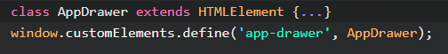
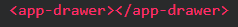

# Web Components

Web Components are a set of web platform API's that allow us to create custom, reusable and encapsulated html tags to use in web pages and web apps

## 3 Main Building Blocks

 

### Custom Elements

- Create custom HTML tags
- Create custom class

- Lifecycle methods available

-constructor(): Called when an instance of the element is created or upgraded

-connectedCallback(): Called everytime when the element is inserted into the DOM

-disconnectedCallback(): Called everytimr the element is removed from the DOM

-attributeChangedCallback(attributeName, oldValue, newValue): Called when an attribute is added, removed, updated or replaced

 
 

### Shadow DOM

- Used for self-contained components
- Encapsulate styles and markup
- Create with element.attachShadow({mode: open})
- Creates a "shadowRoot" that we can reference and interact with

 
 

### HTML Templates

- Define the encapsulated markup of our web compoenents
- Template tag stores markup on page
- Include both HTML and CSS in templates
- Use slots to add custom text